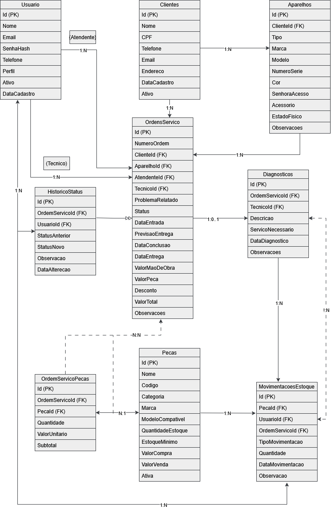

<div align="center">

# 🔧 TechFix

### Sistema de gerenciamento para assistências técnicas

Sistema desenvolvido para organizar o atendimento, a manutenção e o acompanhamento de equipamentos em uma assistência técnica.

</div>

---

## 📖 Sobre o Projeto

O **TechFix** é um sistema de gerenciamento para assistências técnicas desenvolvido para facilitar o processo de atendimento e manutenção de equipamentos.

O sistema possui dois módulos principais:

- 👨‍💼 **Atendente**
- 👨‍🔧 **Técnico**

Esses módulos permitem um fluxo de trabalho organizado, desde o registro da ordem de serviço até a entrega do aparelho ao cliente.

O sistema foi desenvolvido para assistências técnicas que realizam manutenção em:

- 📱 Celulares
- 💻 Notebooks
- 🖥️ Computadores (PCs)

Seu objetivo é centralizar as informações dos atendimentos, proporcionando mais organização, agilidade e controle das ordens de serviço.

---

## ✨ Funcionalidades

### 👨‍💼 Módulo do Atendente

O atendente é responsável por registrar clientes, aparelhos e acompanhar as ordens de serviço.

Principais funcionalidades:

- Cadastro de clientes;
- Cadastro de aparelhos;
- Abertura de ordens de serviço;
- Registro do problema informado pelo cliente;
- Acompanhamento do status do reparo;
- Visualização dos aparelhos concluídos;
- Entrega do equipamento ao cliente.

---

### 👨‍🔧 Módulo do Técnico

O técnico é responsável pelo diagnóstico e reparo dos equipamentos.

Principais funcionalidades:

- Visualização das ordens de serviço;
- Consulta do problema relatado pelo cliente;
- Registro do diagnóstico;
- Busca de peças compatíveis com o equipamento;
- Registro das peças utilizadas;
- Atualização do status do reparo;
- Finalização do conserto.

---

## 🔍 Sistema de Peças

O sistema permite que o técnico pesquise peças compatíveis com o equipamento que está sendo reparado, facilitando a identificação dos componentes corretos para cada modelo.

Também será possível controlar:

- Entrada de peças;
- Saída de peças;
- Peças utilizadas nos reparos;
- Quantidade disponível no estoque.

---

## 📊 Dashboard

O sistema contará com um painel principal para exibir um resumo das ordens de serviço.

O dashboard apresentará informações como:

- Ordens abertas;
- Equipamentos em manutenção;
- Serviços concluídos;
- Equipamentos aguardando entrega.

---

## 📱 Equipamentos Suportados

| Equipamento | Suportado |
|---|:---:|
| 📱 Celulares | ✅ |
| 💻 Notebooks | ✅ |
| 🖥️ Computadores (PCs) | ✅ |

---

## 🔄 Fluxo do Sistema

```text
Cadastro do cliente e do aparelho
              ↓
Abertura da ordem de serviço
              ↓
Recebimento da ordem pelo técnico
              ↓
Diagnóstico do equipamento
              ↓
Pesquisa e registro das peças
              ↓
Realização do reparo
              ↓
Atualização do status
              ↓
Finalização do serviço
              ↓
Entrega do equipamento ao cliente
```

### Etapas do fluxo

1. O atendente registra o cliente e o aparelho.
2. É criada uma ordem de serviço com o problema informado.
3. O técnico recebe a ordem de serviço.
4. O técnico realiza o diagnóstico e o reparo.
5. O técnico registra as peças utilizadas.
6. O técnico atualiza o status do reparo.
7. O técnico finaliza o serviço.
8. O atendente visualiza que o equipamento está pronto.
9. O atendente realiza a entrega ao cliente.

---

## ✅ Requisitos Funcionais

| Código | Requisito |
|---|---|
| **RF01** | O sistema deve permitir que atendentes e técnicos entrem com e-mail e senha. |
| **RF02** | O atendente deve poder cadastrar e consultar clientes. |
| **RF03** | O atendente deve cadastrar celulares, notebooks e computadores vinculados a um cliente. |
| **RF04** | O atendente deve criar uma ordem de serviço com o aparelho e o problema informado pelo cliente. |
| **RF05** | O atendente e o técnico devem poder visualizar as ordens de serviço. |
| **RF06** | O técnico deve registrar o diagnóstico do aparelho. |
| **RF07** | O técnico deve pesquisar peças compatíveis com o aparelho. |
| **RF08** | O técnico deve informar quais peças foram utilizadas no conserto. |
| **RF09** | O sistema deve registrar a entrada e a saída das peças. |
| **RF10** | O técnico deve atualizar o andamento do reparo. |
| **RF11** | O técnico deve registrar quando o serviço estiver concluído. |
| **RF12** | O atendente deve visualizar os aparelhos concluídos e registrar a entrega ao cliente. |
| **RF13** | O sistema deve mostrar um resumo das ordens abertas, em manutenção e concluídas. |
| **RF14** | O usuário deve poder consultar e alterar seus dados e sua senha. |

---

## ⚙️ Requisitos Não Funcionais

| Código | Requisito |
|---|---|
| **RNF01** | O sistema deve ser desenvolvido em C#. |
| **RNF02** | O sistema deve utilizar um banco de dados SQL. |
| **RNF03** | As senhas devem ser protegidas e não podem ser armazenadas como texto normal. |
| **RNF04** | O atendente e o técnico devem acessar somente as funcionalidades permitidas para cada perfil. |
| **RNF05** | A interface deve ser simples, organizada e fácil de utilizar. |
| **RNF06** | O sistema deve validar os dados antes de salvá-los no banco de dados. |

---

## 🗃️ Diagrama do Banco de Dados

Diagrama entidade-relacionamento do sistema TechFix:

<div align="center">



</div>

---

## 🛠️ Tecnologias Utilizadas

| Tecnologia | Utilização |
|---|---|
| **C#** | Desenvolvimento do sistema |
| **Banco de dados SQL** | Armazenamento das informações |

---

## 👥 Perfis de Usuário

| Perfil | Responsabilidades |
|---|---|
| **Atendente** | Cadastrar clientes e aparelhos, abrir ordens de serviço, acompanhar o reparo e registrar a entrega |
| **Técnico** | Visualizar ordens, registrar diagnósticos, pesquisar peças, atualizar o status e finalizar o conserto |

---

<div align="center">

Desenvolvido como projeto de gerenciamento para assistências técnicas.

</div>
